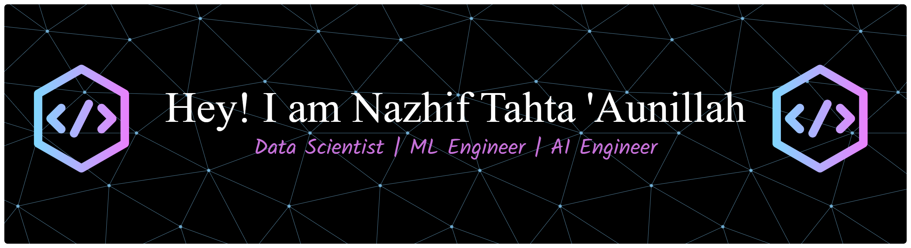

<div align="center">

<!-- Dynamic Typing Header -->
[](https://git.io/typing-svg)

<!-- Profile Views & Followers -->
<p>
  
  
</p>

</div>

---

## 🧠 **ABOUT ME**

```python
class nazhiftahta:
    def __init__(self):
        self.name       = "Nazhif Tahta 'Aunillah"
        self.role       = "Data Scientist | AI Engineer | Machine Learning Engineer"
        self.location   = "Bandung, Indonesia"
        self.languages  = ["Python", "Go", "C++"]
        self.focus      = ["Deep Learning", "NLP", "Data Science"]
        self.currently  = "Building intelligent systems that matter"

    def say_hi(self):
        print("Thanks for dropping by! Let's build something amazing together.")

me = nazhiftahta()
me.say_hi()
```

---

## **CONTACT ME**
<div align="center">

<a href="https://linkedin.com/in/nazhif-tahta" target="_blank">
  
</a>

<a href="mailto:aunillahtahta21@gmail.com">
  
</a>

<a href="https://www.kaggle.com/tahtaaunillah" target="_blank">
  
</a>

<a href="https://github.com/nazhiftahta/nazhiftahta.github.io" target="_blank">
  
</a>

<a href="https://instagram.com/nazhiftahta_21" target="_blank">
  
</a>

</div>

---

## **TECH STACK**

* *Programming Languages*

<div align="center">

  

</div>

---

* *Deep Learning*

<div align="center">

  

</div>

---

* *Machine Learning*

<div align="center">

     

</div>

---

* *Database*

<div align="center">

  

</div>

---

* *Data Visualization*

<div align="center">

  

</div>

---

* *Tools*

<div align="center">

  

</div>

---

## **MY GITHUB STATS**

<div align="center">

<a href="https://github.com/nazhiftahta">
  
</a>

</div>
